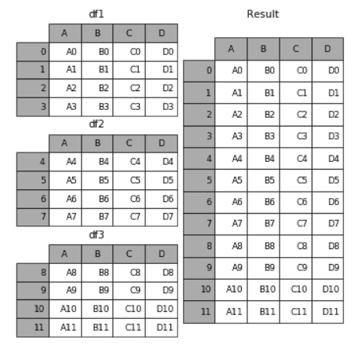
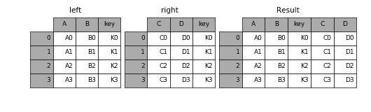
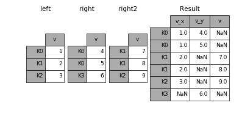

<!--  -->
Référence : https://moncoachdata.com/blog/sqlite-python/
Voir la fonction Pandas  pd.read_sql_query


<!--  -->

Référence : https://moncoachdata.com/blog/8-concepts-python-et-data-science/

# list comprehension
```
numbers = [1, 2, 3, 4, 5]
doubled_odds = [n ** 2 for n in numbers if n % 2 == 1]
```

# lambda
```
double = lambda x: x * 2 

print(double(5)) 
```


# map
```
arr = list(map(int, input().split()))
```

```
result = list(map(lambda var: var*2, seq)) 
print(result) 
```

# filter
```
result = list(filter(lambda x: x > 2, seq)) 
print(result) 
```


# arange
```
# np.arange([start, stop[, step)
np.arange(3, 7, 2)
array([3, 5])
```

# linspace
```
# np.linspace([start, stop], num)
np.linspace(2.0, 3.0, num=5)
array([ 2.0,  2.25,  2.5,  2.75, 3.0])
```

#  Pandas - DataFrame : les lignes sont à 0 et les colonnes à 1
```
df.drop('Row A', axis=0) 
df.drop('Column A', axis=1)
```

# Pandas - DataFrame : concat, merge, join
## concat
Les uns au dessus des autres
<!--  -->


## merge
les uns à côté des autres



## join
Joint en fonction des indices, plutôt que par rapport à d’une colonne spécifiée. Bien voir les NaN ci-dessous



# Pandas - DataFrame : apply
Comme map mais pour une ligne ou une colonne d'un df (une serie)

```
import pandas as pd
import numpy as np

df = pd.DataFrame({'A': [1, 2], 'B': [10, 20]})

df1 = df.apply(np.sum, axis=0)
print(df1)

df1 = df.apply(np.sum, axis=1)
print(df1)
```

```
A     3
B    30
dtype: int64

0    11
1    22
dtype: int64
```

On peut utiliser une fctx lambda

```
import pandas as pd
df = pd.DataFrame({'A': [1, 2], 'B': [10, 20]})
df1 = df.apply(lambda x: x * x)
print(df)
print(df1)
```

```
   A   B
0  1  10
1  2  20

   A    B
0  1  100
1  4  400
```

# Pandas - DataFrame : pivot table